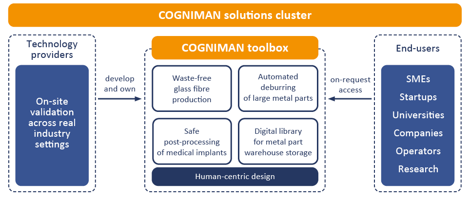

The **COGNIMAN Solutions Cluster** brings together technology providers, industrial validation environments and end-users to accelerate the adoption of advanced manufacturing solutions. At its core is the **COGNIMAN Toolbox**, a set of practical components and methods developed within the project to address key challenges in modern production.

Each solution has been designed following a **human-centric approach**, ensuring that technologies enhance worker safety, usability and productivity.

The toolbox components are **developed and validated on-site in real industrial settings** by technology providers, ensuring their relevance and readiness for practical deployment. Through **on-request access**, the cluster makes these innovations available to **SMEs, startups, universities, companies, operators and researchers**, enabling them to explore, test and adopt advanced manufacturing capabilities.

